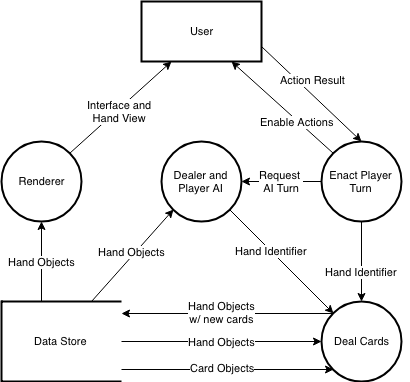

# Carroll’s Blackjack - _Theory_

## Problem Definition

_Blackjack_ is one of the most simple and most common casino card games in the world, featuring a very basic set of rules. _Blackjack_ has high appeal to even non-gamblers due to its low difference between house and player odds. In line with the trend for the demand of online games, we have been individually tasked with building our own implementation of the game of _Blackjack_, for whichever platform we desire. The game must follow standard game rules (found [here](https://www.bicyclecards.com/how-to-play/blackjack/ "Bicycle Cards - Blackjack Rules")), but will not need to incorporate betting. 

I have chosen to design this solution for browsers, using the _Vue.js_ framework to create an interactive website. I have chosen this platform as browsers are generally device and operating system independent, enabling my game to be widely accessible. As per the specification users will need to be able to modify certain elements of the game, including AI players, the dealer, and the amount of shuffled decks. 

Some ethical considerations surrounding this involve the possible user base and the game’s nature as a digital realisation of a casino game. To dismiss these concerns, betting will be completely non-existent in the game. The solution will pose as a standard game, with no links to casinos or gambling at all.

## Needs and Objectives

### Needs

The broad needs for this task include a satisfactory development environment, and a platform to deploy to. For this task I will be using Atom, Google Chrome and a Vue.js compiler on a MacBook Air for development and testing, with the world wide web as my deployment environment.

Needs of the application as defined by the task notification include:
- A game built using object-oriented methodologies
- Ability for decks to be shuffled and played through
- Ability for a human player to participate
- An automatic dealer that follows standard rules
- A planned GUI layout and appropriate UX design
- AI players, that
	- Follow simple player rules
	- Can be customised

As specified above, the game will need to employ the programming paradigm of OOP (Object-Oriented Programming). This will be relatively simple to recreate due to Blackjack being a physical game, in which real objects that have certain properties determine gameplay. This will be recreated in my application using various classes such as Hands and Cards, that each store their own properties and methods. This methodology will also allow for easier maintenance of the future application, as well as much less actual code needing to be written.

### Objectives

The objective of designing this program is to create an enjoyable yet simple version of _Blackjack_, available to play on compatible platforms. As such, the application will need to incorporate sufficient work into its GUI and UX. 

### Boundaries

The limits of this application include:
- No betting functionality
- No multiplayer functionality (local or online)
- No ability to ‘split’ or ‘double’ hands

## Feasibility Report

### Financial/Economic Feasibility

The development of this application is a learning experience for me as a developer, and will not eventuate to a marketable product. As such, there is no cost of development and no earnings to be collected from the final product. The final product will be published on my pre-existing site where there will be no additional costs of hosting, etc. It will be free to play. 

### Technical Feasibility

The technologies used to create this solution are already very familiar to me and this is part of the reason I have chosen them. Programming will be done in _Vue.js_, using _Atom_ to develop and using _Git_ with _BitBucket_ for version control. 

The game of blackjack follows very simple rules, and as such I will not have to delve into algorithm design or any other difficult tasks. The creation of the game is relatively basic and a top-down approach to writing the app will make it even easier.

### Operational Feasibility

In practice, a product that meets the requirements outlined in the Needs and Objectives should operationally be very easy to:
- use, due to the requirement of ‘a planned GUI layout and appropriate UX design’
- maintain, due to the requirement of it being ‘a game built using object-oriented methodologies’
If these core factors are completed successfully, the application should require no training and future developers of the product should easily be able to maintain it.

### Scheduling Feasibility

Due to the clear boundaries outlined above, the application should be easily completed within the allocated time frame of 7 weeks. As the developers of the program are school students presumably completing work for other subjects this time is  very appropriate. If needed, a Gantt chart can be used to plan out the development process, detailing what components should be completed at certain markers in the time frame. It should be taken into consideration that developing multiple components simultaneously will allow for a grater amount of code consistency throughout various similar components (e.g. dealers and AI players) as the developer is in the same headspace.

## Evaluation of Implementation Methodologies

### Direct Cutover

Involves an instant transfer to a new system, in which the old system is no longer accessible as of the cutover date. Is also used for new systems or ones where a replacement was not existent beforehand.

Advantages:
- Quick (one is turned off, other is turned on)
- Cheap (two systems do not have to be managed simultaneously)
- Management costs/time reduced (as above)

Disadvantages:
- New system must be fully working and integrated 
- Data must be converted - high risk of data loss
- Stressful for all involved in switch
- Shock for users if adequate preparation and training is not provided

### Parallel Implementation

Involves a ‘grace’ period in which the new system is active, although the old system is still completely accessible. 

Advantages: 
- Allows users to transition at their own pace
- Allows time for errors/flaws in new system to be discovered by users before they become reliant on it
- Very safe from a data perspective

Disadvantages:
- Costly to manage and maintain multiple systems
- Data has to be kept consistent/pure while being used by both systems, can lead to inconsistencies
- Allows stubborn users to continue using old system until complete cutover date and be unprepared for new system

### Phased Implementation

Phased implementation is a combination of the parallel and direct implementation methods, and involves certain elements of a program being transitioned individually, with the equivalent component of the new system being turned on as the respective component of old system is turned off.

Advantages:
- Steady rate of change for users and allows for time to adapt
- Forces stubborn users to begin using new system
- No duplicate functionality across systems
- Can be used if new system is not fully complete yet and is sill being developed
- Certain modules can be implemented at appropriate times, e.g. financial system after EOFY, logistics system over holiday break, etc.

Disadvantages:
- Stressful for system administrators and maintainers
- Still has most of the cost of managing two seperate systems
- Data has to be kept consistent/pure while being used by both systems, can lead to inconsistencies
- Can be frustrating for some users that are forced to switch often

### Pilot Implementation

Pilot implementations involve the new system being introduced to a small portion of users as a trial, allowing system admins and developers to get feedback and find errors before rolling out to the entire user base.

Advantages:
- Provides a ‘grace period’ similar to that of the parallel implementation
- Any errors/glitches found will only affect a small portion of users, reducing risk 
- These errors and glitches can also be identified, fixed and rolled out quickly due to the low number of users

Disadvantages:
- Can be expensive as similar to the parallel implementation method two full systems are being run concurrently
- Is only really effective with larger user bases
- Data has to be kept consistent/pure while being used by both systems, can lead to inconsistencies

### Recommended Choice for this Solution

For this application, a direct cutover method would be used due to the following factors:
- Very small user base (rules out _pilot_)
- Small scale system (rules out _phased_, no need for _parallel_)
- Low budget (discards _parallel_ and _phased_)
- No pre-existing or replaceable system to be phased out (points to _direct_)

## Diagrams

### Data Flow Diagram

### Dealer’s Flowchart

